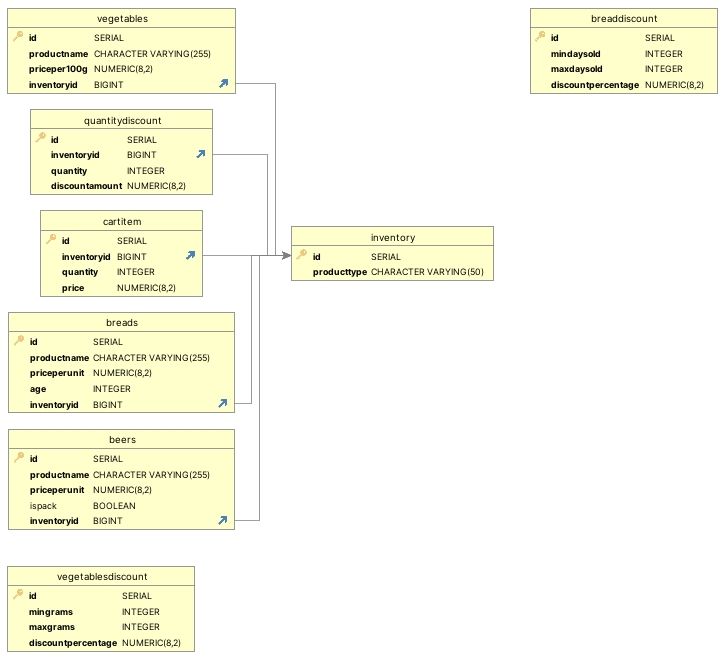

# Inventory Management System

This schema allows for the management of different types of products, their pricing, and applicable discounts. Each product type has its specific table for detailed information, while common properties and discounts are managed through related tables. The hierarchical structure in the Inventory table allows for categorization and sub-categorization of products, making the inventory system more flexible and organized.

## Database Schema Overview

### Tables and Their Purpose

#### Inventory

- **Purpose**: Holds basic information about products and allows for a hierarchical categorization.
- **Columns**:
  - `Id`: Unique identifier for each product (auto-incremented).
  - `ParentId`: Reference to the parent Inventory item, allowing for a hierarchical structure (nullable, self-referencing foreign key).
  - `ProductType`: Type of the product (can only be 'Beer', 'Bread', or 'Vegetable').

### Beer

- **Purpose**: Stores detailed information about beer products.
- **Columns**:
  - `Id`: Unique identifier for each beer product (auto-incremented).
  - `ProductName`: Name of the beer.
  - `PricePerUnit`: Price of one unit of beer.
  - `IsPack`: Indicates if the beer is sold in packs.
  - `InventoryId`: Reference to the corresponding entry in the Inventory table (must be unique).

### Bread

- **Purpose**: Stores detailed information about bread products.
- **Columns**:
  - `Id`: Unique identifier for each bread product (auto-incremented).
  - `ProductName`: Name of the bread.
  - `PricePerUnit`: Price of one unit of bread.
  - `Age`: Age of the bread in days.
  - `InventoryId`: Reference to the corresponding entry in the Inventory table (must be unique).

### Vegetable

- **Purpose**: Stores detailed information about vegetable products.
- **Columns**:
  - `Id`: Unique identifier for each vegetable product (auto-incremented).
  - `ProductName`: Name of the vegetable.
  - `PricePer100g`: Price per 100 grams of the vegetable.
  - `InventoryId`: Reference to the corresponding entry in the Inventory table (must be unique).

### QuantityDiscount

- **Purpose**: Stores discount information for beer products based on quantity.
- **Columns**:
  - `Id`: Unique identifier for each discount entry (auto-incremented).
  - `InventoryId`: Reference to the Inventory table.
  - `BeerId`: Reference to the Beer table.
  - `Quantity`: Required quantity to apply the discount.
  - `DiscountAmount`: Amount of discount applied.

### BreadDiscount

- **Purpose**: Stores discount information for bread products based on age.
- **Columns**:
  - `Id`: Unique identifier for each discount entry (auto-incremented).
  - `MinDaysOld`: Minimum age of the bread to apply the discount.
  - `MaxDaysOld`: Maximum age of the bread to apply the discount.
  - `QuantityMultiplier`: Multiplier applied to the quantity for discount calculation.

### VegetableDiscount

- **Purpose**: Stores discount information for vegetable products based on weight.
- **Columns**:
  - `Id`: Unique identifier for each discount entry (auto-incremented).
  - `MinGrams`: Minimum weight of the vegetables to apply the discount.
  - `MaxGrams`: Maximum weight of the vegetables to apply the discount.
  - `DiscountPercentage`: Percentage discount applied.

### CartItem

- **Purpose**: Stores items added to a shopping cart.
- **Columns**:
  - `Id`: Unique identifier for each cart item (auto-incremented).
  - `InventoryId`: Reference to the Inventory table.
  - `Quantity`: Quantity of the item (in units or grams).
  - `Price`: Price of the item.
  - `ProductName`: Name of the product.
